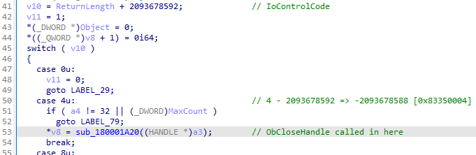
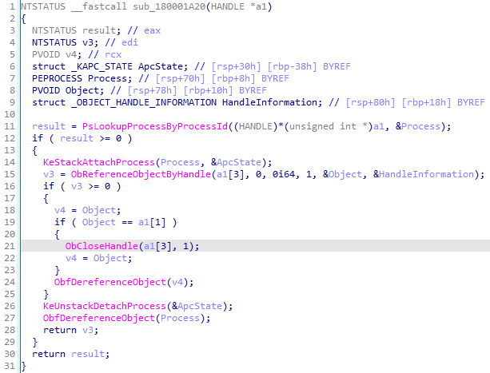
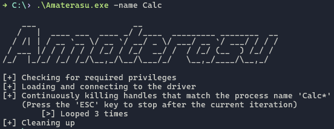

# Amaterasu
## Description
Amaterasu terminates, or inhibits, protected processes such as application control and AV/EDR solutions by leveraging the Sysinternals Process Explorer driver to kill a process's handles from kernel mode. For protected processes which attempt to restore its handles or restarts itself, supply a process name (partial match) and Amaterasu will continuously kill any handles that are associated with that name until you tell it to stop [ESC]. Otherwise, supply the process ID and Amaterasu will stop after the process is terminated.




## Usage
- Kill a specific process by its process ID
    ```
    PS> .\Amaterasu.exe -id 1234
    ```
- Repeatedly kill processes that match a name
    ```
    PS> .\Amaterasu.exe -name Calc
    ```
<details><summary>Example</summary>


</details>

## Credit
 - [Backstab](https://github.com/Yaxser/Backstab) by [@Yas_o_h](https://twitter.com/Yas_o_h)